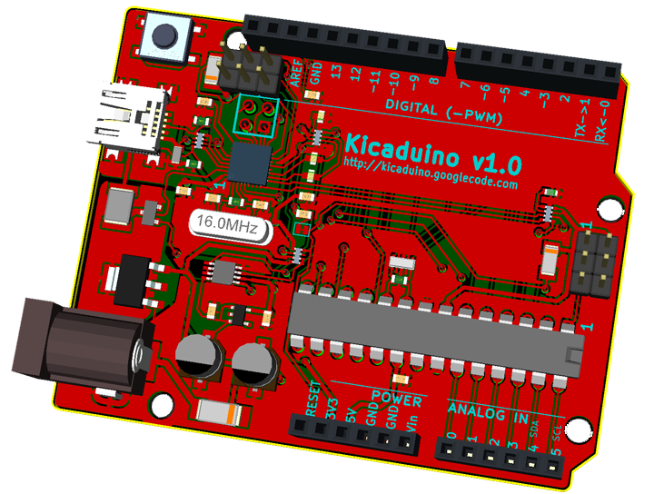

# KiCADuino
### A KiCAD version of the infamous Arduino UNO r3 PCB

There are too few, readily available and open projects in <a href='http://www.kicad-pcb.org'>KiCAD</a> 
format. I'm working to change that -- by taking some I like and re-creating them in KiCAD.

Why? Well, because it seemed a good idea and I seemed to have the time.

I'm starting with the good old Arduino UNO Rev.3, reference design. Obviously, my KiCAD version will not be an 
exact copy. In fact, I'll probably change the USB connector to USB-B-mini SMD. But otherwise, the circuitry 
will be the same, down to the socketed, DIP 'mega328. Maybe I'll do other versions later.

<blockquote>Arduino(TM) is a trademark of the owners of www.arduino.cc (they don't seem to have a name, other 
than Arduino -- even on their trademark information page). This KiCAD re-creation is by a 
separate individual, who is in no way related to the Arduino trademark owners or even likely 
known to them. Please see www.arduino.cc for all official Arduino(TM) information.</blockquote>
